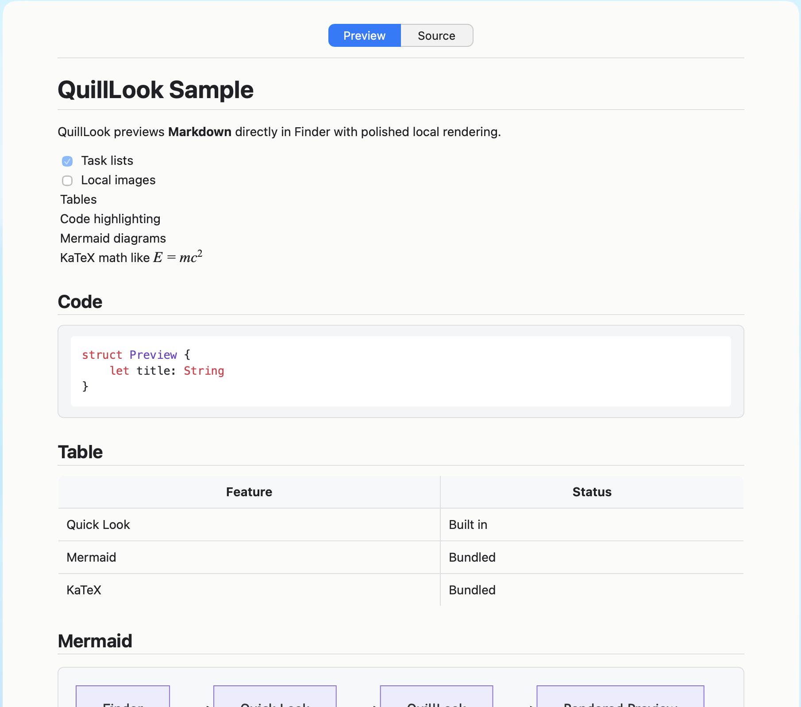

<p align="center">
  
</p>

<h1 align="center">QuillLook</h1>

<p align="center">
  <strong>Preview Markdown in Finder with Space.</strong>
</p>

<p align="center">
  <a href="https://github.com/jonathan-arteaga/quill-look/releases/latest"></a>
  
  
  
</p>

<p align="center">
  <a href="https://github.com/jonathan-arteaga/quill-look/releases/download/v0.1.0/QuillLook-0.1.0-macOS.dmg"><strong>Download</strong></a>
  ·
  <a href="#features">Features</a>
  ·
  <a href="#install">Install</a>
  ·
  <a href="#troubleshooting">Troubleshooting</a>
</p>



QuillLook is a native macOS Quick Look extension for readable Markdown previews in Finder. No editor, no web app, no network request: select a file, press Space, and read.

## Why QuillLook

- Read Markdown without opening an editor.
- Preview docs, notes, READMEs, and MDX files from Finder.
- Keep tables, code, diagrams, math, and images useful at a glance.

## Features

| | |
|---|---|
| **Finder previews** | Preview Markdown directly from Finder with Space. |
| **Readable rendering** | Supports headings, links, lists, blockquotes, tables, task lists, and inline formatting. |
| **Developer docs** | Highlights fenced code blocks and keeps README files easy to scan. |
| **Rich Markdown** | Renders Mermaid diagrams, KaTeX math, and readable local images when present. |
| **Source access** | Switch to the original Markdown when you need to inspect the text. |
| **Local by design** | Files stay on your Mac and do not require an account or network request. |

## Install

1. Download [QuillLook 0.1.0 for macOS](https://github.com/jonathan-arteaga/quill-look/releases/download/v0.1.0/QuillLook-0.1.0-macOS.dmg).
2. Open the guided DMG.
3. Drag `QuillLook.app` into Applications.
4. Open QuillLook once so macOS can register the extension.
5. Select a Markdown file in Finder and press Space.

If prompted, allow QuillLook in System Settings. After that, use it directly from Finder.

The DMG is signed with Developer ID, notarized by Apple, and stapled for public distribution.

> [!NOTE]
> QuillLook handles `md`, `markdown`, `mdown`, `mkd`, `mkdn`, and `mdx` files.

## Privacy

Files stay on your Mac. QuillLook does not upload content, call a web service, or require an account. Bundled assets load from the app, and web links open outside the preview.

## Remove QuillLook

Open the DMG and launch `Uninstall QuillLook.app`.

The uninstaller confirms first, removes QuillLook, unregisters the extension, clears caches/preferences, and refreshes Quick Look. If needed, macOS may ask for an administrator password. Your Markdown files are not touched.

## Troubleshooting

<details>
<summary>QuillLook does not show the preview I expected</summary>

### QuillLook does not appear in Quick Look

Open QuillLook once from Applications, then try Finder again. If prompted, enable the extension in System Settings.

### The preview still looks stale after editing

Finder sometimes caches previews. Select another file, return to the Markdown file, and press Space again. If it still looks stale:

```bash
qlmanage -r cache
```

### I see duplicate QuillLook entries

This usually means macOS found old development builds. For normal installs, run `Uninstall QuillLook.app` from the DMG, then install the current DMG again.

Developers can clean local build registrations from the repo:

```bash
./script/build_and_run.sh --clean-stale
```

### Why do I need to open the app once?

QuillLook is a normal Mac app containing a Quick Look extension. Opening it once lets macOS discover that extension.

### Where does QuillLook show up?

In Finder. Select a supported Markdown file and press Space. The app window is only for onboarding, samples, and cleanup.

</details>

## Build From Source

<details>
<summary>Build from source, package the DMG, and publish releases</summary>

QuillLook uses XcodeGen to generate the Xcode project.

Build, install locally, refresh Quick Look, and launch the app:

```bash
./script/build_and_run.sh --verify
```

Create the public signed and notarized DMG:

```bash
./script/package_dmg.sh
```

The DMG is written to:

```text
dist/QuillLook-0.1.0-macOS.dmg
```

Public packaging requires a Developer ID Application certificate and a stored notary profile named `quilllook-notary`.

```bash
xcrun notarytool store-credentials quilllook-notary \
  --apple-id YOUR_APPLE_ID \
  --team-id YOUR_TEAM_ID \
  --password YOUR_APP_SPECIFIC_PASSWORD
```

Publish the notarized DMG to the GitHub release:

```bash
./script/publish_release.sh
```

For local testing only, you can also create an ad-hoc signed zip:

```bash
./script/package_release.sh
```

</details>

## Status

QuillLook is early but usable. The current focus is a fast, minimal Finder preview before preferences, an updater, or App Store polish.
