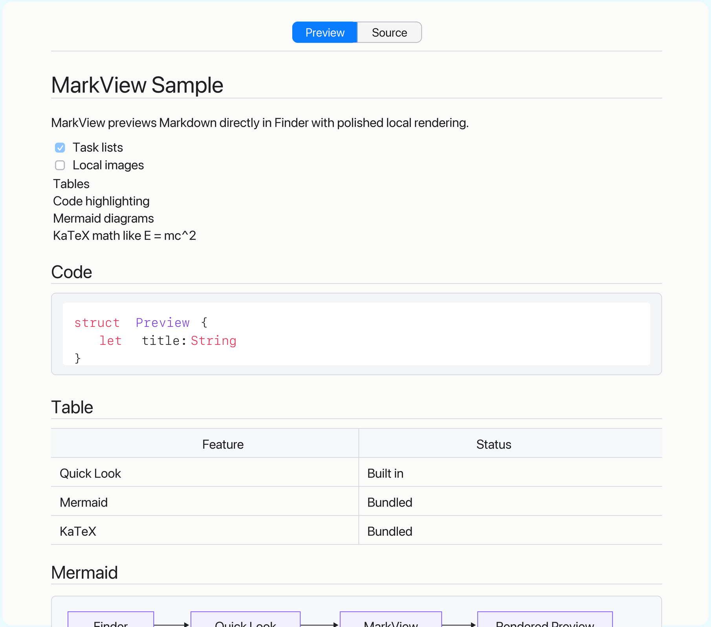

<p align="center">
  
</p>

<h1 align="center">MarkView</h1>

<p align="center">
  <strong>Preview Markdown in Finder with Space.</strong>
</p>

<p align="center">
  
  
  
</p>

<p align="center">
  <a href="#install"><strong>Install</strong></a>
  ·
  <a href="#features">Features</a>
  ·
  <a href="#build-from-source">Build</a>
  ·
  <a href="#troubleshooting">Troubleshooting</a>
</p>



MarkView is a native macOS Quick Look extension for readable Markdown previews in Finder. No editor, no web app, no network request: select a file, press Space, and read.

## Why MarkView

- Read Markdown without opening an editor.
- Preview docs, notes, READMEs, and MDX files from Finder.
- Keep tables, code, diagrams, math, and images useful at a glance.

## Features

| | |
|---|---|
| **Finder previews** | Preview Markdown directly from Finder with Space. |
| **Readable rendering** | Supports headings, links, lists, blockquotes, tables, task lists, and inline formatting. |
| **Developer docs** | Highlights fenced code blocks and keeps README files easy to scan. |
| **Rich Markdown** | Renders Mermaid diagrams, KaTeX math, and readable local images when present. |
| **Source access** | Switch to the original Markdown when you need to inspect the text. |
| **Local by design** | Files stay on your Mac and do not require an account or network request. |

## Install

Public MarkView downloads will start with the first MarkView release. For now, build and install locally:

```bash
./script/build_and_run.sh --verify
```

Then select a Markdown file in Finder and press Space.

If prompted, allow MarkView in System Settings. After that, use it directly from Finder.

> [!NOTE]
> MarkView handles `md`, `markdown`, `mdown`, `mkd`, `mkdn`, and `mdx` files.

## Privacy

Files stay on your Mac. MarkView does not upload content, call a web service, or require an account. Bundled assets load from the app, and web links open outside the preview.

## Remove MarkView

Remove `MarkView.app` from Applications, then refresh Quick Look:

```bash
qlmanage -r
qlmanage -r cache
```

Packaged releases include `Uninstall MarkView.app`, which removes MarkView, unregisters its extension, clears caches/preferences, and refreshes Quick Look. Your Markdown files are not touched.

## Troubleshooting

<details>
<summary>MarkView does not show the preview I expected</summary>

### MarkView does not appear in Quick Look

Open MarkView once from Applications, then try Finder again. If prompted, enable the extension in System Settings.

### The preview still looks stale after editing

Finder sometimes caches previews. Select another file, return to the Markdown file, and press Space again. If it still looks stale:

```bash
qlmanage -r cache
```

### I see duplicate MarkView entries

This usually means macOS found old development builds. For packaged installs, run `Uninstall MarkView.app` from the DMG, then install the current DMG again.

Developers can clean local build registrations from the repo:

```bash
./script/build_and_run.sh --clean-stale
```

### Why do I need to open the app once?

MarkView is a normal Mac app containing a Quick Look extension. Opening it once lets macOS discover that extension.

### Where does MarkView show up?

In Finder. Select a supported Markdown file and press Space. The app window is only for onboarding, samples, and cleanup.

</details>

## Build From Source

<details>
<summary>Build from source, package the DMG, and publish releases</summary>

MarkView uses XcodeGen to generate the Xcode project.

Build, install locally, refresh Quick Look, and launch the app:

```bash
./script/build_and_run.sh --verify
```

Create the public signed and notarized DMG:

```bash
./script/package_dmg.sh
```

The DMG is written to:

```text
dist/MarkView-0.1.1-macOS.dmg
```

Public packaging requires a Developer ID Application certificate and a stored notary profile named `markview-notary`.

```bash
xcrun notarytool store-credentials markview-notary \
  --apple-id YOUR_APPLE_ID \
  --team-id YOUR_TEAM_ID \
  --password YOUR_APP_SPECIFIC_PASSWORD
```

Publish the notarized DMG to the GitHub release:

```bash
./script/publish_release.sh
```

For local testing only, you can also create an ad-hoc signed zip:

```bash
./script/package_release.sh
```

</details>

## Status

MarkView is early but usable. The current focus is a fast, minimal Finder preview before preferences, an updater, or App Store polish.
